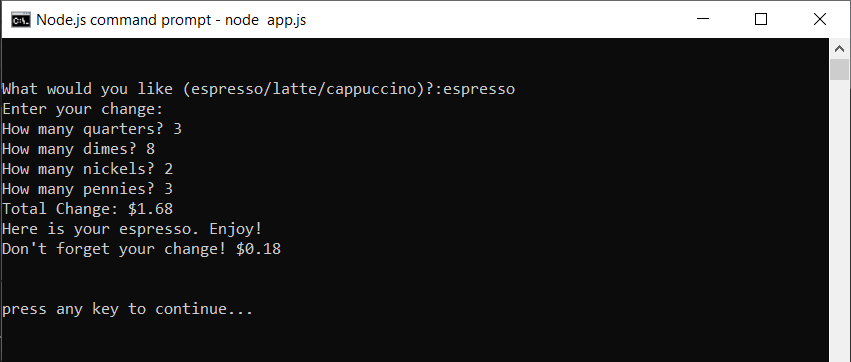
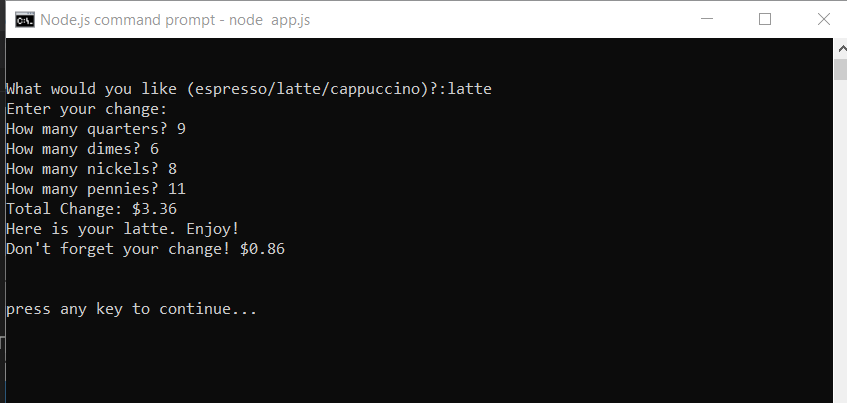
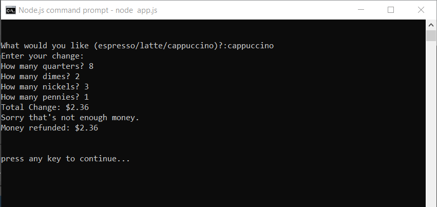
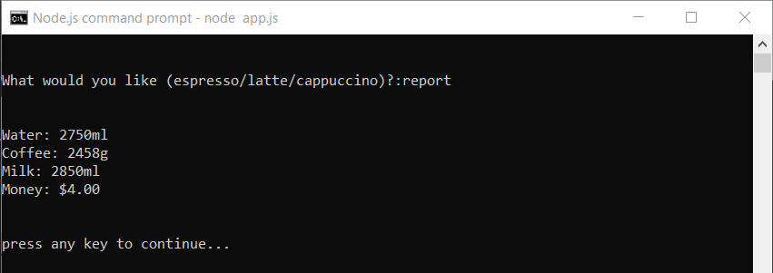

# 100 Days of Code - Day 15 - Coffee Machine

# Prompt

1. Prompt the user by asking "What would you like? (espresso/latte/cappuccino): "
* check the user's input to decide what to do next.
* the prompt should show every time action has completed. e.g. once the drink is dispensed. The prompt should show again to serve the next customer.
* espresso recipe: 50ml water, 18g Coffee
* Latte recipe: 200ml water, 24g Coffee, 150ml Milk
* Cappuccino Recipe: 250ml Water, 24g Coffee, 100ml Milk

2. Turn off the Coffee Machine by entering "off" to the prompt.
* For maintainers of the coffee machine, they can use "off" as the secret word to turn off the machine. Your code should end execution when this happens.

3. Print Report
* When the user enters "report" to the prompt, a report should be generated that shows the current resource values:
    * Water: 100ml
    * Milk: 50ml
    * Coffee: 76g
    * Money: $2.5

4. Check resources sufficient?
* When the user chooses a drink, the program should check if there are enough resources to make that drink.
* E.g. If latte requires 200ml water but there is only 100ml left in the machine, it should not continue to make the drink but print "Sorry, there is not enough water."
* The same should happen if another resource is depleted, e.g. milk or coffee.

5. Process Coins.
* If there are sufficient resources to make the drink selected, then the program should prompt the user to insert coins.
* Remember that quarters = $0.25, dimes = $0.10, nickles = $0.05, pennies = $0.01.
* Calculate the monetary values of the coins inserted: e.g. 1 quarter, 2 dimes, 1 nickel, 2 pennies = 0.25 = $0.52

6. Check transaction successful
* Check that the user has inserted enough money to purchase the drink they selected. e.g. latte cost $2.50 but they only inserted $.52, then after counting the coins the program should say "Sorry, that's not enough money. Money refunded."
* But if the user has inserted enough money, then the cost of the drink gets added to the machine as the profit and this will be reflected the next time report is triggered.
* If the user has inserted too much money, the machine should offer change.
* Change should be rounded to 2 decimal places.

7. Make Coffee
* if the transaction is successful and there are enough resources to make the drink the user selected, then the ingredients to make the drink should be deducted from the coffee machine resources.
* Once all the resources have been deducted, tell the user: "Here is your latte. Enjoy!" if the latte was their choice drink.

# Screenshot of Working Solution

